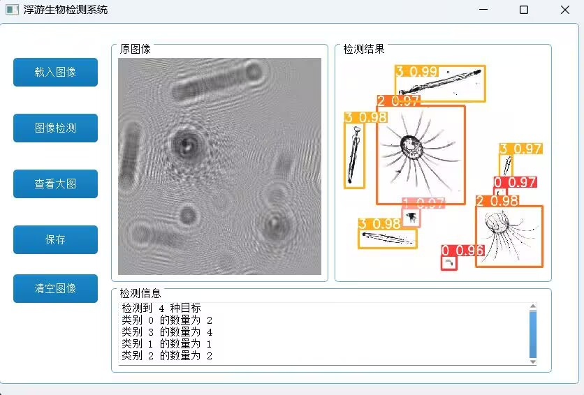

# PyQt-SegmentationCounter

## 项目简介

**PyQt-SegmentationCounter** 是一个基于 YOLOv5 和 UNet 的图像目标检测和分割系统，主要用于目标的的分割、检测和计数。该系统提供了一个基于 PyQt 的用户界面，用户可以通过该界面对图像进行加载、检测、分割和计数等操作。

## 功能

- **图像加载**：支持从本地加载图像。
- **图像分割和目标检测**：使用 UNet 进行图像分割，YOLOv5 进行目标检测。
- **目标计数**：系统会检测图像中各类目标并计算每种目标的数量。
- **图像结果展示**：系统将分割和检测的结果显示在用户界面中，标注出每种目标的置信度和类别。

## 项目结构

```
├── PyQt5_stylesheets/         # PyQt5 界面样式文件
├── UNet/                      # UNet 模型相关代码
├── yolov5/                    # YOLOv5 模型相关代码
├── 图片测试/                   # 存放测试图像的文件夹
├── bs_rc.py                   # PyQt5 资源文件
├── Image_format.py            # 图像格式处理代码
├── infer_all.py               # 推理和检测模块
├── main.py                    # 主程序入口，启动 PyQt5 界面
```

## 环境要求

- Python 3.8+
- PyTorch
- PyQt5
- OpenCV

## 安装

1. 克隆此仓库到本地：

```bash
git clone https://github.com/yourusername/PyQt-SegmentationCounter.git
```

2. 安装依赖：

```bash
pip install torch pyqt5 opencv-python torch
```

## 使用方法

### 1. 训练 UNet 模型

在开始使用系统进行检测之前，您需要训练 UNet 模型以实现图像分割。请按照以下步骤操作：

1. 在 `UNet/` 文件夹下，准备好训练数据，确保数据集包含标注好的图像和分割掩码。
2. 运行 UNet 训练脚本：

   ```bash
   python UNet/train.py
   ```

   确保训练过程中保存的权重文件存放在 `UNet/weights/` 文件夹下。

### 2. 训练 YOLOv5 模型

YOLOv5 模型用于检测图像中的具体目标，您需要先训练该模型：

1. 在 `yolov5/` 文件夹中，准备 YOLOv5 的数据集（图片和标签）。
2. 运行 YOLOv5 训练脚本：

   ```bash
   python train.py --img 640 --batch 16 --epochs 50 --data data.yaml --weights yolov5s.pt
   ```

   **注意**：训练完成后，确保生成的权重文件保存在 `yolov5/weights/` 文件夹中。

### 3. 运行主程序

完成模型训练后，您可以运行系统进行图像检测和分割：

1. 运行主程序：

   ```bash
   python main.py
   ```

2. 使用 PyQt 图形界面进行操作：
   - 点击“加载图像”按钮从本地选择一张图像。
   - 点击“图像检测”按钮进行目标分割和检测。
   - 检测结果将展示在界面的右侧，同时显示每种目标的数量和类别。

## 示例

系统界面如下图所示：



## 贡献

欢迎大家提出问题 (Issues) 或贡献代码 (Pull Requests)。如果你有任何问题，请联系我。


---

### 更新说明

- 添加了 UNet 和 YOLOv5 模型的训练步骤。
